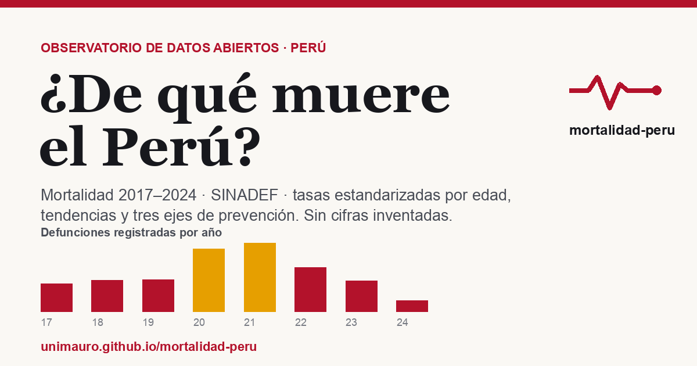

# Observatorio de Mortalidad del Perú

**¿De qué muere el Perú?** Dashboard estático con las series anuales de mortalidad
del país (SINADEF, 2017–2026), tasas estandarizadas por edad, análisis de
tendencias y tres ejes de prevención: **metabólico/cardiovascular**,
**criminalidad** y **accidentes**.

🔗 **Sitio:** https://unimauro.github.io/mortalidad-peru/

> Regla de oro del proyecto: **cero cifras inventadas**. Todo dato es trazable a
> su fuente oficial; los vacíos y quiebres de serie se muestran, no se rellenan.



---

## Qué responde

- ¿De qué muere la población peruana, año por año?
- ¿Qué causas aumentan y cuáles bajan, en número y en **tasa estandarizada por edad**?
- Tres ejes de prevención con **semáforo** (solo marca tendencia cuando es
  estadísticamente significativa):
  - **Metabólico/cardiovascular:** diabetes, hipertensivas, isquémicas del
    corazón, cerebrovasculares y enfermedad renal crónica.
  - **Criminalidad:** homicidios y suicidios (registrados en el certificado).
  - **Accidentes:** tránsito, caídas, ahogamiento, intoxicaciones y otros.
- Además: cáncer por tipo, VIH/sida, COVID-19, y perfil por sexo, edad y departamento.

## Fuentes de datos (verificadas)

| Fuente | Uso | Años | URL |
|---|---|---|---|
| **SINADEF** (MINSA) | Defunciones y causas CIE-10 (microdata) | 2017–2026* | [datosabiertos.gob.pe](https://www.datosabiertos.gob.pe/dataset/informaci%C3%B3n-de-fallecidos-del-sistema-inform%C3%A1tico-nacional-de-defunciones-sinadef-ministerio) |
| **INEI** — Estimaciones y Proyecciones de Población (base Censo 2017) | Denominadores de tasas | 2017–2026 | [inei.gob.pe](https://www.inei.gob.pe/) |
| **CEIC-INEI** (homicidios) / **INEI-MININTER** (tránsito) | Contraste de causas externas | 2017–2025 | [inei.gob.pe](https://www.inei.gob.pe/) |
| **GBD — IHME** (U. Washington) | Carga real estimada (referencia metodológica) | 1990–2021 | [healthdata.org/gbd](https://www.healthdata.org/research-analysis/gbd) |
| **peru-geojson** (juaneladio) | Límites departamentales | — | [github](https://github.com/juaneladio/peru-geojson) |

\* La microdata oficial de SINADEF (DATOS ABIERTOS, MINSA) se actualiza a diario y
cubre de 2017 al día de hoy. El año en curso se muestra como *parcial*. La
codificación CIE-10 de la causa va con rezago, por lo que el detalle por causa de
los años más recientes es provisional.

## Metodología (resumen)

- **Causa básica** = último código CIE-10 no vacío de la cadena de causas A→F del
  certificado (aproximación estándar a la selección oficial).
- **Agrupación de causas** aproximada por capítulos CIE-10 (no es la Lista 10/110
  oficial del MINSA); documentada en [`pipeline/config/grupos_cie10.py`](pipeline/config/grupos_cie10.py).
- **Tasa estandarizada por edad**: método directo con la Población Estándar
  Mundial (OMS) y denominadores del INEI (la estructura por edad de 2020 se
  reescala al total de cada año, supuesto documentado).
- **Tendencias**: regresión log-lineal de la tasa estandarizada sobre los años
  completos (2017–2025); el semáforo solo marca dirección cuando el IC 95% de la
  pendiente excluye el cero.
- **Quiebres de serie** señalados en los gráficos: rollout de SINADEF (2017–2019),
  COVID-19 (2020–2022), disrupción de SINADEF (2022), año parcial (2026).
- Cruces por departamento con **< 5 defunciones suprimidos**.
- **Subregistro**: las cifras son un *piso* (muertes registradas), no el total
  real. Las causas externas (homicidios, tránsito) están especialmente
  sub-registradas en el certificado; el dato fino proviene de MP/INEI/PNP/MTC.

Análisis **descriptivo**: no afirma causalidad ni proyecta al futuro.

## Estructura

```
index.html                     página principal
assets/                        estilos, JS, ECharts, GeoJSON, favicon, OG
pipeline/
  descargar.py                 baja la microdata de SINADEF (no se versiona el crudo)
  procesar.py                  limpia y agrega -> data/processed/*.json
  generar_imagenes.py          OG + favicons
  config/
    grupos_cie10.py            agrupación de causas + población estándar OMS
    poblacion_inei.json        denominadores oficiales del INEI
data/
  raw/                         crudo de SINADEF (.gitignore)
  processed/                   datos.json (agregados, ~275 KB) + metadata.json
.github/workflows/update-data.yml   actualización automática mensual
```

## Ejecutar localmente

```bash
python3 -m venv venv && source venv/bin/activate
pip install pandas numpy openpyxl Pillow
python pipeline/descargar.py      # baja el ZIP de SINADEF (~617 MB) y extrae el CSV a data/raw/
python pipeline/procesar.py       # genera data/processed/datos.json
python pipeline/generar_imagenes.py
python3 -m http.server 8000       # abre http://localhost:8000
```

## Actualización automática

El workflow [`update-data.yml`](.github/workflows/update-data.yml) corre el día 1
de cada mes (y a mano con *workflow_dispatch*): descarga → procesa → valida → si
hay cambios, commitea `data/processed/` y redepliega vía GitHub Pages. Si una
fuente no responde o hay una variación anómala, **no sobrescribe** los datos
vigentes y abre un *Issue* automático.

> GitHub deshabilita los workflows programados tras 60 días sin actividad en el
> repositorio; el commit mensual mantiene la actividad. Si se pausa, basta con
> ejecutar el workflow manualmente una vez para reactivarlo.

## Licencia

Código bajo licencia **MIT** (ver [LICENSE](LICENSE)). Los datos pertenecen a sus
fuentes oficiales (MINSA/SINADEF, INEI) y se usan bajo sus términos de datos abiertos.
